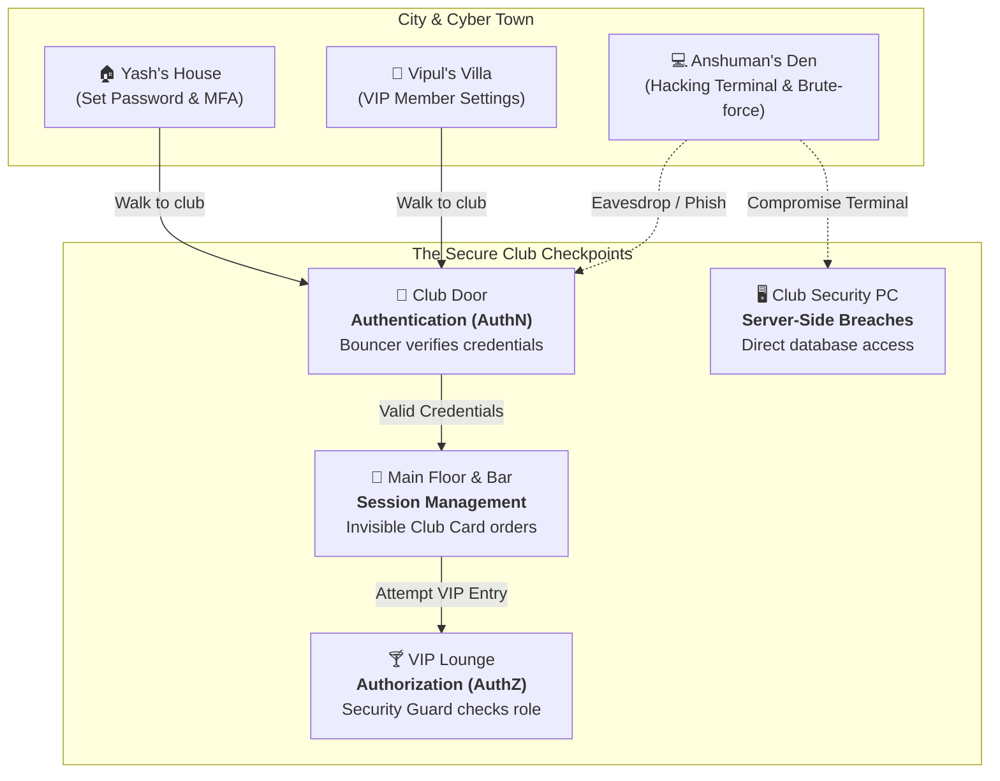

# 🛡️ The Secure Club

> **An interactive 2D cybersecurity awareness web game teaching Passwords, Authentication, Authorization, Sessions, Account Takeover, and Multi-Factor Authentication.**

[](https://yashrana738.github.io/The-Secure-Club/)
[](LICENSE)

🎮 **Play directly in your browser without installation:**  
👉 **[https://yashrana738.github.io/The-Secure-Club/](https://yashrana738.github.io/The-Secure-Club/)**

---

[](https://developer.mozilla.org/en-US/docs/Web/JavaScript)
[](https://developer.mozilla.org/en-US/docs/Web/API/Canvas_API)
[](https://developer.mozilla.org/en-US/docs/Web/CSS)
[-success)](#architecture)
[](#-testing--verification)

---

## 📖 Overview

**The Secure Club** turns abstract cybersecurity concepts into tactile, intuitive game mechanics. Instead of reading dry theory, players step into a simulated cyberpunk city and nightclub where security mechanisms are physically embodied by characters, access checkpoints, and interactive terminals.

Players can switch between multiple perspectives—navigating the venue as legitimate club members or stepping into the shoes of an attacker exploiting human mistakes and system flaws.



---

## 🎯 Core Cybersecurity Concepts Taught

| Concept | Real-World Principle | In-Game Representation |
| :--- | :--- | :--- |
| **Authentication (AuthN)** | *"Who are you?"* — Verifying a claimed identity against credentials. | The **Bouncer** checks your name and secret phrase at the club entrance. |
| **Authorization (AuthZ)** | *"What can you access?"* — Enforcing permissions on an authenticated identity. | The **Security Guard** checks your privilege level before letting you into the **VIP Lounge**. |
| **Passwords & Secrets** | *"Something you know"* — Knowledge factors, entropy, and secrets. | Secret phrases (`Blue Mango`, `Golden Tiger`) required for verification. |
| **Multi-Factor Auth (MFA)** | Requiring credentials from two or more distinct factor categories. | Combining *"Something you know"* (phrase) + *"Something you have"* (Club Security ID). |
| **Session Management** | Persistent state and session tokens after initial authentication. | **The Invisible Club Card**: The Bartender charges orders directly to the active session. |
| **Session Hijacking & ATO** | Account Takeover resulting in fraudulent attribution. | Attacker uses a stolen session to buy drinks—billed to the victim's tab. |
| **Eavesdropping & Sniffing** | Shoulder surfing and unencrypted communication interception. | Attacker lurks near the entrance door recording members stating their credentials. |
| **Social Engineering / Phishing**| Deceptive impersonation to trick victims into surrendering secrets. | Attacker disguises as a club bouncer to solicit member credentials. |
| **Server-Side Data Breaches** | Direct database/infrastructure compromise vs. user-side mistakes. | Attacker accesses an unlocked Security PC terminal to dump credentials directly. |

---

## 🕹️ Playable Characters & Roles

- **Yash (Regular Member)**  
  A standard club member. Holds valid credentials (`123456` / `Blue Mango`), can enter the main floor, but is **denied entry to the VIP Lounge** due to lack of VIP permissions.
  
- **Vipul (VIP Member)**  
  A high-clearance club member (`Golden Tiger`). Holds both valid authentication credentials and **authorized VIP Lounge privileges**.

- **Anshuman (The Threat Actor)**  
  Explores offensive cybersecurity tactics:
  - 👂 **Eavesdropping**: Lurk near the entrance to capture credentials spoken in plaintext.
  - 🎭 **Phishing Disguise**: Don a fake bouncer uniform to solicit secret phrases from patrons.
  - 💻 **Terminal Exploitation**: Breach the club's backend security terminal to extract member records.
  - 🔓 **Account Takeover**: Impersonate legitimate members at the door and abuse active sessions at the bar.

- **Non-Player Characters (NPCs)**:
  - **The Bouncer**: Operates as the **Authentication Gateway**.
  - **Security Guard**: Enforces Role-Based Access Control (**Authorization**).
  - **Bartender**: Demonstrates automatic session billing and audit trail attribution.

---

## 🎮 Controls & Exploration

| Action | Control |
| :--- | :--- |
| **Move Character** | **Left Click** anywhere on the ground (includes pathfinding and wall collision) |
| **Pan World View** | **Click and Drag** mouse across the canvas |
| **Switch Character** | Click character pills (**Yash / Vipul / Anshuman**) in top-left HUD |
| **Interact with Buildings** | Click on **Yash's House**, **Vipul's Villa**, or **Anshuman's Den** |
| **Access System Menu & Quiz** | Press **`Esc`** or click the floating ⚙️ gear button in the top-right |
| **Combat / Dialogue Encounters** | Select on-screen command buttons in the Pokémon-style battle dialogue box |

---

## ✨ Features

- **🎮 Top-Down 2D Sandbox Simulation**:  
  Custom canvas-based 2D engine with smooth movement, collision boundaries, and camera tracking.
- **⚔️ Pokémon-Style 2-Sided Battle/Dialogue Encounters**:  
  Dynamic interactive encounter overlay with HP/Security status plates, dialogue, and branching action commands.
- **📊 Real-Time Character HUD**:  
  Collapsible status card tracking role, cash, password strength, access permissions, security ID, and active factor status.
- **🎓 Contextual Educational Cards**:  
  Interactive learning modals triggered at key story milestones explaining the theoretical principles behind each event.
- **🧠 10-Question Cyber Quiz**:  
  In-game assessment module reinforcing learned concepts with immediate feedback and explanations.
- **⚡ Zero External Runtime Dependencies**:  
  Built strictly with standards-compliant HTML5, CSS3, and ES6 JavaScript modules.

---

## 🚀 Running Locally

Because the game uses native ECMAScript Modules (`import` / `export`), it must be served over an HTTP server.

### Option 1: Live Web (No Setup)
Play instantly on GitHub Pages:  
👉 **[https://yashrana738.github.io/The-Secure-Club/](https://yashrana738.github.io/The-Secure-Club/)**

### Option 2: Python HTTP Server

```bash
# Clone the repository
git clone https://github.com/YashRana738/The-Secure-Club.git
cd The-Secure-Club

# Start local server
python -m http.server 8000
```
Open `http://localhost:8000` in your browser.

### Option 3: Node.js / npx

```bash
npx serve .
```

### Option 4: VS Code Live Server
Open the folder in VS Code, right-click `index.html`, and select **"Open with Live Server"**.

---

## 🧪 Testing & Verification

The project includes an automated Python verification suite validating all security logic:

```bash
python tests/test_security.py
```

```
.........
----------------------------------------------------------------------
Ran 9 tests in 0.001s

OK
```

The test suite validates:
1. **Authentication**: Rejection of incorrect phrases; acceptance of verified identities; unknown account handling.
2. **Authorization**: Principle of least privilege (Yash denied VIP; Vipul granted VIP; attacker authenticated as Yash remains barred from VIP).
3. **Multi-Factor Authentication**: Enforcement of 2nd factor possession checks; prevention of single-factor bypass.
4. **Sessions**: Proper token generation upon authentication; immediate disconnection upon revocation.
5. **Audit Trail**: Verification that actions performed during an Account Takeover are recorded against the hijacked session.

---

## 📂 Project Architecture

```
The-Secure-Club/
├── index.html                  # Main application entry point & UI shell
├── README.md                   # Project documentation & guides
├── LICENSE                     # MIT Open-Source License
├── docs/
│   └── architecture.md         # Technical architecture specification
├── src/
│   ├── app.js                  # Main orchestration controller & state manager
│   ├── content/
│   │   └── contentData.js      # Educational cards, definitions, and quiz questions
│   ├── game/
│   │   ├── gameWorld.js        # Simulation world, entity physics, and interaction triggers
│   │   └── pixelRenderer.js    # Canvas 2D graphics rendering, lighting & camera
│   ├── security/
│   │   ├── authentication.js   # Credential verification, MFA, and password strength checks
│   │   ├── authorization.js    # RBAC logic, access control list (ACL) rules
│   │   ├── sessions.js         # Session issuance, storage, and lifecycle management
│   │   └── auditLog.js         # Security audit logging and incident tracing
│   └── styles/
│       └── main.css            # Dark cyberpunk-themed styling, animations & UI layouts
└── tests/
    ├── check_ids.py            # DOM element & ID reference sanity checks
    └── test_security.py        # Automated security subsystem unit test suite
```

---

## 📜 License

This project is open-source under the [MIT License](LICENSE).
